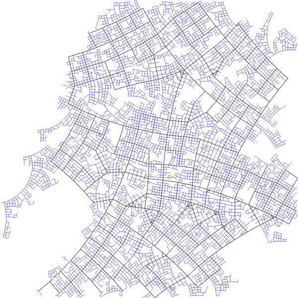
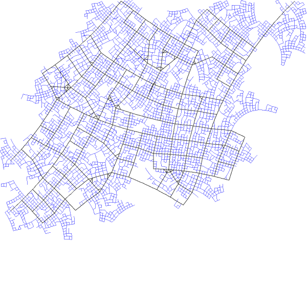
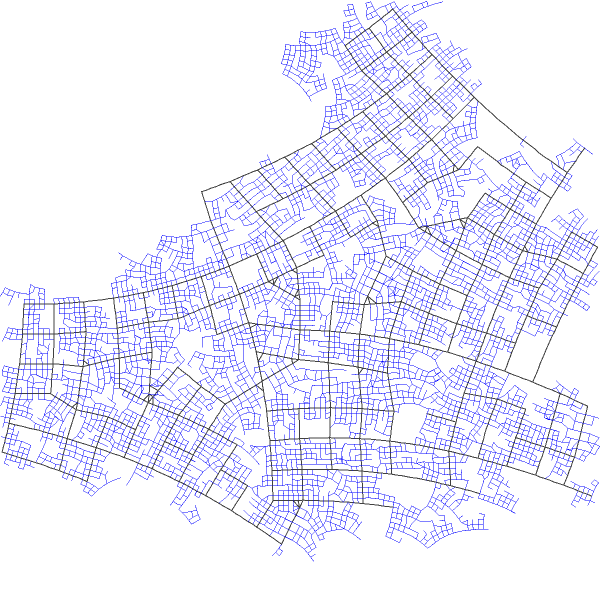

# city-generator
Experimental procedural generation of a city, for use in [my city simulation](https://github.com/DomWilliams0/well-designed-simulation).

## GUI

*Cover your eyes!*

## Example renders
 
 
 
 
